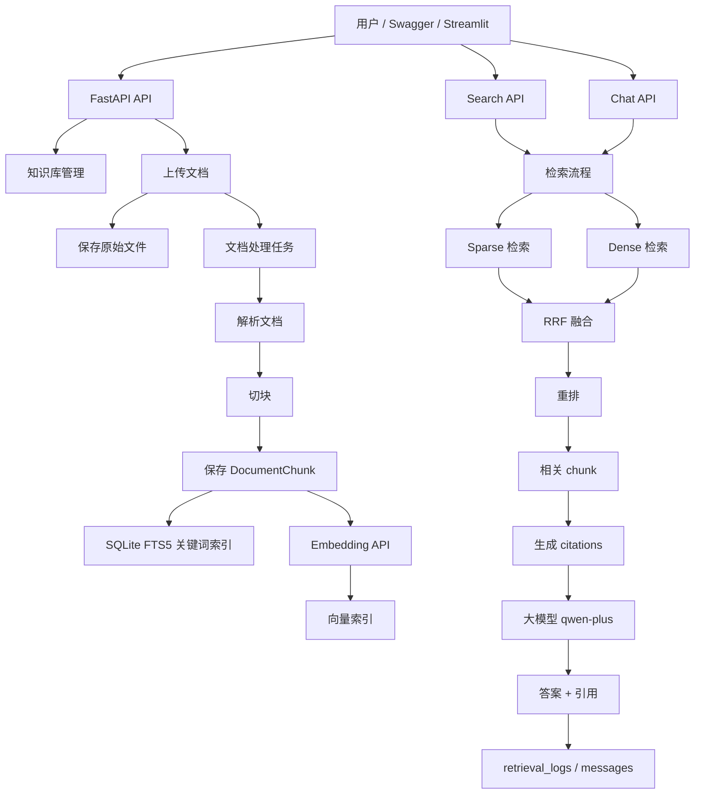

# Local Enterprise RAG 项目知识点总结

本文档系统总结本项目涉及的核心流程、接口、工具、方法原理、配置项、常见问题和扩展方向。它既可以作为项目说明书，也可以作为学习 RAG 工程化实现的笔记。

当前项目定位：

- 单用户本地企业知识库。
- 支持上传文档、解析文档、切块、建立关键词索引和向量索引。
- 支持搜索和基于证据的问答。
- 当前外部 API 运行版使用 DashScope embedding 和 `qwen-plus` 聊天模型。
- 项目默认仍保留 mock embedding / mock generation，方便本地无 API key 时跑通流程。

---

## 1. 项目一句话概括

这个项目是一个本地 RAG 知识库系统：

```text
用户上传文档
  -> 系统解析文档
  -> 切成小块 chunk
  -> 为 chunk 建关键词索引和向量索引
  -> 用户提问时先检索相关 chunk
  -> 把证据交给大模型
  -> 返回带引用的答案
```

RAG 的核心不是“训练模型”，而是“检索外部知识 + 让模型基于检索证据回答”。

---

## 2. 项目目录结构

主要目录和文件：

```text
app/
  main.py                  FastAPI 应用入口
  api/
    routes.py              所有 API 路由
    deps.py                FastAPI 依赖
  core/
    config.py              配置读取和环境变量
    errors.py              统一业务异常
    logging.py             JSON 日志
    middleware.py          request_id 中间件
  db/
    models.py              SQLAlchemy ORM 模型
    session.py             数据库 engine/session
    init_db.py             启动时初始化数据库
    fts.py                 SQLite FTS5 全文检索
  services/
    storage.py             上传文件校验与落盘
    documents.py           文档上传、状态、重试、删除
    processing.py          文档处理主流程
    parsers.py             TXT/MD/DOCX/PDF 解析
    chunking.py            文档切块
    embeddings.py          embedding 服务
    vector_store.py        ChromaDB/local 向量库
    retrieval.py           检索、融合、重排
    chat.py                问答、调用大模型
    citations.py           引用生成和校验
    conversations.py       会话和消息
    logs.py                检索日志读取
    evaluation.py          检索评估指标
  workers/
    celery_app.py          Celery 配置
    tasks.py               后台任务入口
  cli/
    seed_demo.py           Demo 数据导入脚本

streamlit_app.py           简单 Streamlit 前端
tests/                     自动测试
alembic/                   数据库迁移
Dockerfile                 容器构建
docker-compose.yml         API/worker/redis/streamlit 编排
README.md                  项目快速说明
```

---

## 3. 整体架构



---

## 4. 运行时角色

### 4.1 FastAPI

FastAPI 是后端 API 框架。

入口：

```text
app/main.py
```

职责：

- 创建 Web 应用。
- 注册路由。
- 注册中间件。
- 注册统一异常处理器。
- 启动时初始化数据库和 FTS5 表。

启动命令示例：

```powershell
python -m uvicorn app.main:app --host 127.0.0.1 --port 8000
```

### 4.2 SQLite

SQLite 是项目默认数据库。

保存内容包括：

- 知识库。
- 文档记录。
- 文档 chunk。
- 会话。
- 消息。
- 检索日志。
- 后台任务状态。

默认数据库文件：

```text
data/app.db
```

当前外部 API 版使用：

```text
data/external_run/app.db
```

### 4.3 SQLite FTS5

FTS5 是 SQLite 的全文检索扩展。

它负责关键词检索，也叫 sparse retrieval。

核心表：

```text
document_chunks_fts
```

代码位置：

```text
app/db/fts.py
```

它适合：

- 精确关键词。
- 文件里的专有名词。
- 数字、条款、编号。
- 明确出现过的短语。

### 4.4 Embedding API

Embedding API 把文本转换为向量。

代码位置：

```text
app/services/embeddings.py
```

当前外部 API 版：

```text
provider = dashscope
model = text-embedding-v4
dimension = 1024
```

作用：

```text
"报销需要在 30 天内提交"
  -> [0.012, -0.023, 0.344, ...]
```

向量用于语义检索，也叫 dense retrieval。

### 4.5 ChromaDB / LocalVectorStore

项目支持两种向量存储方式：

```text
ChromaDB         真正的本地向量数据库
LocalVectorStore 本地 fallback，查询时线性扫描所有 chunk
```

代码位置：

```text
app/services/vector_store.py
```

当前外部 API 版为了方便运行，使用：

```text
RAG_VECTOR_STORE_BACKEND=local
```

含义：

- 上传时仍然调用真实 DashScope embedding。
- 查询时重新计算 query 和 chunk 的相似度。
- 数据少时可以用。
- 数据大时应切换 ChromaDB。

### 4.6 Celery + Redis

Celery 是 Python 后台任务队列。

Redis 是 Celery 的 broker。

项目里文档处理链路本来适合放后台执行：

```text
上传文档
  -> API 快速返回
  -> Celery worker 后台解析、切块、索引
```

本地默认：

```text
RAG_CELERY_TASK_ALWAYS_EAGER=true
```

意思是任务不真的进入 Redis，而是同步执行，便于测试。

Docker Compose 中：

```text
RAG_CELERY_TASK_ALWAYS_EAGER=false
```

这时会真正使用 Redis + worker。

### 4.7 Streamlit

项目有一个简单前端：

```text
streamlit_app.py
```

功能：

- 创建知识库。
- 上传文档。
- 搜索。
- 问答。
- 查看文档状态。

当前本机环境中 Streamlit 因 `pandas/numpy` 二进制兼容问题没有运行，主要通过 Swagger 测试。

### 4.8 Swagger / OpenAPI

FastAPI 自动生成 Swagger 页面：

```text
http://127.0.0.1:8000/docs
```

它可以直接测试接口：

- 填 JSON body。
- 上传文件。
- 查看响应。
- 复制 curl 请求。

---

## 5. 核心数据模型

模型定义：

```text
app/db/models.py
```

### 5.1 KnowledgeBase

知识库。

关键字段：

```text
id
name
description
embedding_provider
embedding_model
embedding_dimension
chunk_size
chunk_overlap
created_at
updated_at
```

作用：

- 文档集合边界。
- 保存切块参数。
- 保存 embedding 配置。

当前项目是单用户项目，所以没有：

```text
user_id
tenant_id
permission
```

### 5.2 Document

原始文档记录。

关键字段：

```text
id
knowledge_base_id
original_filename
stored_filename
storage_path
file_extension
mime_type
file_size
sha256
status
failed_stage
error_message
page_count
chunk_count
task_id
retry_count
```

状态流转：

```text
pending
processing
completed
failed
deleting
deleted
```

### 5.3 DocumentChunk

文档切块。

RAG 检索的最小证据单位。

关键字段：

```text
id
knowledge_base_id
document_id
chunk_index
content
content_hash
token_count
page_number
section_title
element_type
source_filename
metadata_json
chroma_collection_name
chroma_vector_id
```

搜索、问答、引用都围绕 chunk 工作。

### 5.4 Conversation

聊天会话。

字段：

```text
id
knowledge_base_id
title
created_at
updated_at
```

### 5.5 Message

会话里的消息。

字段：

```text
id
conversation_id
role
content
citations_json
retrieval_log_id
model_name
latency_ms
created_at
```

role 通常是：

```text
user
assistant
```

### 5.6 RetrievalLog

检索日志。

这是排查 RAG 效果最重要的表。

记录内容：

```text
query
retrieval_mode
dense_results_json
sparse_results_json
fusion_results_json
rerank_results_json
final_evidence_json
fallback_used
fallback_reason
retrieval_latency_ms
generation_latency_ms
total_latency_ms
model_name
error_code
error_message
```

用途：

- 看 sparse 搜到了什么。
- 看 dense 搜到了什么。
- 看融合后是什么。
- 看最后给模型的证据是什么。
- 分析回答质量问题。

### 5.7 BackgroundTask

后台任务状态。

字段：

```text
id
document_id
celery_task_id
task_type
status
progress
current_stage
error_message
```

前端可以轮询它展示上传处理进度。

---

## 6. 创建知识库流程

接口：

```text
POST /knowledge-bases
```

代码链路：

```text
app/api/routes.py
  -> create_kb()
  -> app/services/knowledge_bases.py
  -> create_knowledge_base()
  -> SQLite knowledge_bases
```

推荐请求体：

```json
{
  "name": "我的知识库",
  "description": "用于上传文档测试"
}
```

也可以传：

```json
{
  "name": "我的知识库",
  "description": "用于上传文档测试",
  "chunk_size": 800,
  "chunk_overlap": 120
}
```

不建议手动乱填：

```text
embedding_provider
embedding_model
embedding_dimension
```

因为当前服务端已经配置好：

```text
DashScope text-embedding-v4
1024 维
```

### 6.1 chunk_size

每个文本块的最大长度。

本项目近似按字符切分，不是严格 token。

较小的 chunk：

- 更精确。
- 上下文少。
- 容易切断语义。

较大的 chunk：

- 上下文完整。
- 可能包含无关信息。
- 占用更多上下文。

### 6.2 chunk_overlap

相邻 chunk 的重叠长度。

作用：

- 防止答案刚好被切在两个 chunk 中间。
- 保留边界上下文。

必须满足：

```text
chunk_overlap < chunk_size
```

推荐：

```text
chunk_size = 800
chunk_overlap = 120
```

---

## 7. 上传文档流程

接口：

```text
POST /knowledge-bases/{kb_id}/documents
```

代码链路：

```text
routes.upload_kb_document()
  -> services.documents.upload_document()
  -> services.storage.read_upload_bytes()
  -> services.storage.create_document_from_upload()
  -> workers.tasks.enqueue_document_processing()
  -> services.processing.run_document_processing()
```

### 7.1 上传时做了什么

1. 检查知识库是否存在。
2. 读取文件内容。
3. 检查文件大小。
4. 计算 SHA256。
5. 清理文件名。
6. 校验扩展名。
7. 校验 MIME。
8. 检查同一知识库内是否重复。
9. 保存原始文件。
10. 创建 Document 记录。
11. 创建 BackgroundTask。
12. 触发文档处理。

### 7.2 支持格式

```text
.pdf
.docx
.txt
.md
.markdown
```

### 7.3 文件去重

同一知识库内使用 SHA256 去重。

即：

```text
同一知识库 + 相同文件内容 -> 不允许重复上传
不同知识库 + 相同文件内容 -> 允许上传
```

### 7.4 文件保存位置

类似：

```text
data/uploads/{kb_id}/{uuid}.md
data/external_run/uploads/{kb_id}/{uuid}.md
```

---

## 8. 文档处理流程

主函数：

```text
app/services/processing.py
run_document_processing()
```

阶段：

```text
validating
parsing
chunking
saving_chunks
indexing_fts
embedding
indexing_vectors
verifying
completed
```

### 8.1 validating

确认：

- Document 记录存在。
- 原始文件存在。

### 8.2 parsing

解析不同文件格式。

代码：

```text
app/services/parsers.py
```

不同格式：

```text
TXT       直接读取文本
Markdown 识别标题
DOCX     优先 Docling，回退 python-docx
PDF      优先 Docling，回退 pypdf
```

输出统一结构：

```text
ParsedDocument
  elements: list[DocumentElement]
```

DocumentElement 包含：

```text
content
page_number
section_title
element_type
metadata
```

### 8.3 chunking

代码：

```text
app/services/chunking.py
```

步骤：

1. 规范化换行和空白。
2. 按 chunk_size 切分。
3. 尽量在换行或句号处切。
4. 使用 chunk_overlap 保留重叠。
5. 计算 content_hash。
6. 同文档内去重。

Chunk 是检索最小单位。

### 8.4 saving_chunks

把 chunk 写入：

```text
document_chunks
```

保存内容包括：

- 正文。
- 页码。
- 章节。
- 原文件名。
- hash。
- metadata。

### 8.5 indexing_fts

把 chunk 写入 FTS5 虚拟表：

```text
document_chunks_fts
```

用于关键词检索。

### 8.6 embedding

调用 embedding 服务：

```text
get_embedding_service().embed_texts(...)
```

当前外部 API 版：

```text
DashScope text-embedding-v4
```

注意：

DashScope embeddings 接口单次 input 不应超过 10 条。本项目已修复为自动分批。

### 8.7 indexing_vectors

把向量写入向量存储。

如果使用 ChromaDB：

```text
保存向量、文本、metadata
```

如果使用 local fallback：

```text
只记录 fallback 信息，查询时重新计算向量并线性扫描
```

---

## 9. 搜索流程

接口：

```text
POST /knowledge-bases/{kb_id}/search
```

代码：

```text
app/services/retrieval.py
```

请求示例：

```json
{
  "query": "报销需要多久提交",
  "top_k": 5,
  "retrieval_mode": "hybrid_rerank"
}
```

返回核心字段：

```text
results
log_id
fallback_used
fallback_reason
```

### 9.1 retrieval_mode

支持四种：

```text
sparse
dense
hybrid
hybrid_rerank
```

### 9.2 sparse 检索

关键词检索。

用：

```text
SQLite FTS5
BM25
```

适合：

- 原文出现过的关键词。
- 数字。
- 条款。
- 文件名。
- 专有名词。

缺点：

- 不理解语义。
- 同义表达可能搜不到。

### 9.3 dense 检索

向量语义检索。

流程：

```text
query -> embedding -> 向量相似度 -> top_k chunk
```

适合：

- 同义问法。
- 语义相近表达。
- 用户问题和文档措辞不完全一致。

缺点：

- 依赖 embedding 模型质量。
- 成本更高。
- 有时会召回语义相关但关键词不精确的内容。

### 9.4 hybrid 检索

同时做：

```text
sparse + dense
```

然后融合。

### 9.5 RRF 融合

RRF 是 Reciprocal Rank Fusion。

核心思想：

```text
不直接比较 sparse 和 dense 的原始分数
而是比较它们各自的排名
```

公式近似：

```text
score += 1 / (rrf_k + rank)
```

优点：

- 不需要把 BM25 分数和 cosine similarity 强行归一化。
- 如果一个 chunk 同时在 sparse 和 dense 排名前列，它会被排到更前。

### 9.6 rerank

当前项目的 rerank 是轻量版：

```text
计算 query 词项和 chunk 内容的词面重叠
重叠越多，分数越高
```

真实生产系统可以换成：

- Cross Encoder reranker。
- BGE reranker。
- LLM reranker。

---

## 10. 问答流程

接口：

```text
POST /knowledge-bases/{kb_id}/chat
```

请求示例：

```json
{
  "query": "报销需要在多久内提交？",
  "top_k": 5,
  "retrieval_mode": "hybrid_rerank"
}
```

代码链路：

```text
routes.chat_kb()
  -> services.chat.chat_with_knowledge_base()
  -> retrieval.retrieve()
  -> citations.build_citations()
  -> generate_answer()
  -> OpenAI-compatible chat API
  -> 保存 messages 和 retrieval_logs
```

### 10.1 与 search 的区别

search：

```text
只返回检索到的 chunk
```

chat：

```text
先检索 chunk
再把 chunk 作为证据交给大模型
最后返回自然语言答案
```

### 10.2 citation 引用

Citation 包含：

```text
citation_id
chunk_id
document_id
source_filename
page_number
section_title
quote
```

系统会校验：

```text
quote 必须真实存在于 chunk.content 中
```

这样可以降低模型胡乱引用的风险。

### 10.3 refusal 拒答

如果没有有效证据：

```text
refusal = true
```

项目会返回拒答，而不是强行编答案。

### 10.4 当前外部模型

当前 8000 外部 API 版：

```text
RAG_GENERATION_PROVIDER=openai-compatible
RAG_CHAT_MODEL=qwen-plus
RAG_OPENAI_BASE_URL=https://dashscope.aliyuncs.com/compatible-mode/v1
```

生成逻辑使用 OpenAI SDK 调用兼容接口。

---

## 11. 主要 API 接口

### 11.1 健康检查

```text
GET /health
```

只检查应用进程是否活着。

返回：

```json
{
  "status": "ok"
}
```

### 11.2 就绪检查

```text
GET /ready
```

会访问数据库。

返回：

```json
{
  "status": "ready"
}
```

### 11.3 创建知识库

```text
POST /knowledge-bases
```

请求：

```json
{
  "name": "我的知识库",
  "description": "用于上传文档测试"
}
```

成功返回：

```json
{
  "id": "xxx",
  "name": "我的知识库",
  "description": "用于上传文档测试",
  "chunk_size": 800,
  "chunk_overlap": 120
}
```

### 11.4 查看知识库列表

```text
GET /knowledge-bases
```

用于找回 kb_id。

### 11.5 查看知识库详情

```text
GET /knowledge-bases/{kb_id}
```

### 11.6 修改知识库

```text
PATCH /knowledge-bases/{kb_id}
```

可改：

```text
name
description
chunk_size
chunk_overlap
```

注意：

修改 chunk 参数不会自动重建已上传文档，需要调用 reindex。

### 11.7 删除知识库

```text
DELETE /knowledge-bases/{kb_id}
```

会清理：

- ORM 数据。
- FTS5 记录。
- 向量库记录。

### 11.8 知识库统计

```text
GET /knowledge-bases/{kb_id}/stats
```

返回：

```text
document_count
completed_document_count
failed_document_count
chunk_count
```

### 11.9 上传文档

```text
POST /knowledge-bases/{kb_id}/documents
```

参数：

```text
kb_id
file
```

### 11.10 查看知识库文档

```text
GET /knowledge-bases/{kb_id}/documents
```

### 11.11 查看单个文档

```text
GET /documents/{document_id}
```

### 11.12 查看文档处理状态

```text
GET /documents/{document_id}/status
```

### 11.13 重试文档处理

```text
POST /documents/{document_id}/retry
```

适用于：

```text
failed
pending
```

### 11.14 重建索引

```text
POST /documents/{document_id}/reindex
```

会重新：

- 解析。
- 切块。
- 建 FTS5。
- 调 embedding。
- 建向量索引。

### 11.15 删除文档

```text
DELETE /documents/{document_id}
```

会删除：

- 文件。
- chunk。
- FTS5。
- 向量索引。

### 11.16 搜索

```text
POST /knowledge-bases/{kb_id}/search
```

请求：

```json
{
  "query": "文档里的问题",
  "top_k": 5,
  "retrieval_mode": "hybrid_rerank"
}
```

### 11.17 问答

```text
POST /knowledge-bases/{kb_id}/chat
```

请求：

```json
{
  "query": "根据文档回答问题",
  "top_k": 5,
  "retrieval_mode": "hybrid_rerank"
}
```

继续同一会话：

```json
{
  "query": "那超过期限怎么办？",
  "conversation_id": "上一次返回的 conversation_id",
  "top_k": 5,
  "retrieval_mode": "hybrid_rerank"
}
```

### 11.18 查看会话列表

```text
GET /conversations
```

可选参数：

```text
knowledge_base_id
```

### 11.19 查看单个会话

```text
GET /conversations/{conversation_id}
```

### 11.20 查看检索日志

```text
GET /retrieval-logs/{log_id}
```

---

## 12. 配置系统

配置文件：

```text
app/core/config.py
.env
.env.example
```

所有环境变量使用：

```text
RAG_
```

前缀。

### 12.1 关键配置

```text
RAG_DATA_DIR
RAG_DATABASE_URL
RAG_REDIS_URL
RAG_CELERY_TASK_ALWAYS_EAGER
RAG_VECTOR_STORE_BACKEND
RAG_EMBEDDING_PROVIDER
RAG_EMBEDDING_MODEL
RAG_EMBEDDING_DIMENSION
RAG_GENERATION_PROVIDER
RAG_CHAT_MODEL
RAG_OPENAI_API_KEY
RAG_OPENAI_BASE_URL
RAG_DASHSCOPE_API_KEY
RAG_DASHSCOPE_BASE_URL
```

### 12.2 当前外部 API 版配置

当前 8000 实例大致等价于：

```text
RAG_DATA_DIR=./data/external_run
RAG_DATABASE_URL=sqlite:///./data/external_run/app.db
RAG_VECTOR_STORE_BACKEND=local
RAG_EMBEDDING_PROVIDER=dashscope
RAG_EMBEDDING_MODEL=text-embedding-v4
RAG_EMBEDDING_DIMENSION=1024
RAG_GENERATION_PROVIDER=openai-compatible
RAG_CHAT_MODEL=qwen-plus
RAG_OPENAI_BASE_URL=https://dashscope.aliyuncs.com/compatible-mode/v1
RAG_DASHSCOPE_BASE_URL=https://dashscope.aliyuncs.com/compatible-mode/v1
RAG_CELERY_TASK_ALWAYS_EAGER=true
```

密钥从外部 env 文件读取，不应写入代码。

### 12.3 external_env_file

项目支持：

```text
RAG_EXTERNAL_ENV_FILE=../Langchain/.env
```

用于复用外部项目中的 API key。

---

## 13. 大模型 API 调用

项目中有两类外部 API。

### 13.1 Embedding API

用于：

- 上传文档时：chunk -> embedding。
- 搜索/问答时：query -> embedding。

代码：

```text
app/services/embeddings.py
```

支持：

```text
mock
openai
openai-compatible
dashscope
```

### 13.2 Chat API

用于：

```text
证据 chunk + 用户问题 -> 自然语言答案
```

代码：

```text
app/services/chat.py
```

支持：

```text
mock
openai
openai-compatible
```

当前使用：

```text
qwen-plus
```

### 13.3 mock 模式

mock embedding：

```text
hash_embedding()
```

特点：

- 本地确定性。
- 不调用外部 API。
- 不具备真实语义能力。
- 适合测试链路。

mock generation：

```text
直接把证据拼成答案
```

特点：

- 不调用大模型。
- 可以验证检索是否正确。

---

## 14. 工具和库介绍

### 14.1 FastAPI

Python Web API 框架。

优势：

- 自动生成 OpenAPI/Swagger。
- 和 Pydantic 深度集成。
- 类型标注友好。

### 14.2 Pydantic

数据校验和 schema 定义。

文件：

```text
app/schemas/api.py
```

作用：

- 校验请求体。
- 定义响应结构。
- 生成 OpenAPI 文档。

### 14.3 SQLAlchemy

ORM 框架。

文件：

```text
app/db/models.py
app/db/session.py
```

作用：

- Python 类映射数据库表。
- 统一数据库访问。
- 管理关系和级联删除。

### 14.4 Alembic

数据库迁移工具。

文件：

```text
alembic/
alembic.ini
```

命令：

```powershell
alembic upgrade head
```

### 14.5 SQLite

轻量本地数据库。

优点：

- 零服务依赖。
- 适合本地单用户。
- 文件就是数据库。

限制：

- 并发写能力有限。
- 大规模生产多用户场景应考虑 PostgreSQL。

### 14.6 SQLite WAL

项目启动 SQLite 时设置：

```text
PRAGMA journal_mode=WAL
```

作用：

- 提升读写并发体验。
- 减少锁冲突。

### 14.7 SQLite FTS5

全文检索扩展。

特点：

- 使用倒排索引。
- 支持 MATCH 查询。
- 支持 BM25 排序。

### 14.8 OpenAI Python SDK

用于调用：

- OpenAI。
- OpenAI-compatible API。
- DashScope 兼容模式。

项目用统一 SDK 调不同 provider。

### 14.9 DashScope

阿里云通义千问相关 API。

当前使用：

```text
text-embedding-v4
qwen-plus
```

base_url：

```text
https://dashscope.aliyuncs.com/compatible-mode/v1
```

### 14.10 ChromaDB

本地向量数据库。

作用：

- 保存 embedding。
- 按向量相似度检索。

当前项目可以自动 fallback 到 local。

### 14.11 Celery

后台任务队列。

适合处理：

- 大文件解析。
- OCR。
- 批量 embedding。
- 长时间索引任务。

### 14.12 Redis

Celery broker。

在 Docker Compose 中启用。

### 14.13 Docling

可选文档解析工具。

优先用于：

- DOCX。
- PDF。

未安装时回退。

### 14.14 python-docx

DOCX 回退解析。

能读取：

- 段落。
- 标题样式。
- 表格文本。

### 14.15 pypdf

PDF 回退解析。

只能较好处理可复制文本 PDF。

扫描版 PDF 需要 OCR。

### 14.16 PaddleOCR

项目中预留 OCR fallback。

但当前 MVP 没有配置 PDF 页面渲染到图片，所以扫描 PDF 的 OCR 尚未真正完成。

### 14.17 Streamlit

快速搭建 Python 前端。

本项目中只是 demo client，不直接访问数据库，只调 FastAPI。

### 14.18 Docker Compose

用于同时启动：

```text
api
worker
redis
streamlit
```

---

## 15. 方法原理

### 15.1 RAG

RAG = Retrieval-Augmented Generation。

中文通常叫：

```text
检索增强生成
```

核心思想：

```text
不把所有知识训练进模型
而是在提问时先检索相关资料
再让模型基于资料回答
```

优点：

- 知识更新快。
- 成本低。
- 可引用来源。
- 可排查证据。
- 不需要微调模型。

缺点：

- 检索失败会导致回答失败。
- 文档解析质量很关键。
- 切块策略影响很大。
- embedding 模型质量影响召回。
- 模型仍可能忽略证据或误解证据。

### 15.2 倒排索引

FTS5 背后类似倒排索引。

例如：

```text
报销 -> chunk1, chunk7
审批 -> chunk3, chunk7
```

查询时快速找到包含关键词的 chunk。

### 15.3 BM25

BM25 是经典搜索相关性排序算法。

它考虑：

- 查询词是否出现。
- 出现频率。
- 文档长度。
- 词是否稀有。

在 FTS5 中：

```sql
bm25(document_chunks_fts)
```

### 15.4 Embedding

Embedding 把文本映射为高维向量。

语义相似的文本，向量距离通常更近。

例如：

```text
"报销多久提交"
"票据需要多少天内交"
```

文字不同，但语义相近，embedding 能帮助召回。

### 15.5 Cosine Similarity

余弦相似度。

衡量两个向量方向是否接近。

数值越大，越相似。

### 15.6 Sparse vs Dense

Sparse：

```text
关键词检索
```

Dense：

```text
语义向量检索
```

对比：

| 类型 | 优点 | 缺点 |
|---|---|---|
| Sparse | 精确、快、适合关键词 | 不懂语义 |
| Dense | 语义召回强 | 成本高，可能不精确 |
| Hybrid | 兼顾两者 | 实现复杂 |

### 15.7 RRF

RRF 解决不同检索器分数不可比的问题。

Sparse 的 BM25 分数和 Dense 的向量相似度不是一个尺度，不能简单相加。

RRF 用排名融合：

```text
rank 越靠前，加分越高
```

### 15.8 Citation Validation

引用校验的目标：

```text
回答中的引用必须能回到真实 chunk
```

本项目做法：

```text
quote in chunk.content
```

不满足就丢弃 citation。

### 15.9 Refusal

当没有证据时，系统应该拒答。

这是企业知识库非常重要的行为。

否则模型可能编造答案。

---

## 16. 检索日志怎么看

调用：

```text
GET /retrieval-logs/{log_id}
```

重点字段：

```text
sparse_results
dense_results
fusion_results
rerank_results
final_evidence
```

排查方式：

1. `sparse_results` 为空：关键词没命中，可能是用户问法和文档措辞不同。
2. `dense_results` 差：embedding 模型效果不好，或者 chunk 太短/太长。
3. `fusion_results` 有正确答案但 `final_evidence` 没有：融合或重排策略有问题。
4. `final_evidence` 正确但回答错误：大模型生成或 prompt 约束有问题。
5. `citations` 为空：引用校验没通过，quote 可能没对上 chunk 原文。

---

## 17. 测试

测试目录：

```text
tests/
```

### 17.1 API 流程测试

文件：

```text
tests/test_api_flow.py
```

覆盖：

- health。
- ready。
- 创建知识库。
- 上传 Markdown。
- 搜索。
- 聊天。
- 重复文档校验。

### 17.2 切块和评估测试

文件：

```text
tests/test_chunking_and_eval.py
```

覆盖：

- 切块稳定性。
- 去重。
- recall@k。
- precision@k。
- hit_rate@k。
- mrr@k。
- ndcg@k。

### 17.3 上传安全测试

文件：

```text
tests/test_storage.py
```

覆盖：

- 文件名清理。
- 扩展名校验。
- MIME 校验。

### 17.4 运行测试

```powershell
python -m pytest --basetemp .pytest_tmp
```

如果系统临时目录权限有问题，使用 `--basetemp` 指定项目内临时目录。

### 17.5 代码检查

```powershell
python -m ruff check app streamlit_app.py
python -m ruff format --check app streamlit_app.py
```

---

## 18. 常见问题

### 18.1 创建知识库成功了吗

看响应码：

```text
201
```

表示创建成功。

返回里的：

```text
id
```

就是 kb_id。

### 18.2 上传文档后怎么测试

推荐顺序：

```text
GET /documents/{document_id}/status
POST /knowledge-bases/{kb_id}/search
POST /knowledge-bases/{kb_id}/chat
GET /retrieval-logs/{log_id}
```

### 18.3 chunk_overlap 和 chunk_size 是什么

`chunk_size`：

```text
每个文本块最大长度
```

`chunk_overlap`：

```text
相邻文本块重叠长度
```

目的：

- 保留上下文。
- 避免句子被切断。

### 18.4 embedding_dimension 是什么

向量维度。

当前：

```text
text-embedding-v4 -> 1024
```

不要随便填。

### 18.5 为什么 search 有结果但 chat 拒答

可能原因：

- citation quote 没通过校验。
- top_k 太小。
- 检索结果不是真正证据。
- query 太泛。

### 18.6 为什么上传失败

常见失败阶段：

```text
validating      文件不存在
parsing         文件解析失败
chunking        没有生成 chunk
embedding       API key、网络、模型参数、批量限制
indexing_vectors 向量库问题
```

查看：

```text
GET /documents/{document_id}/status
```

### 18.7 扫描版 PDF 为什么不行

`pypdf` 只能抽取可复制文本。

扫描版 PDF 需要：

- PDF 渲染成图片。
- OCR 识别。
- 再进入解析和切块。

当前项目 OCR 尚未完整实现。

### 18.8 为什么 Streamlit 没运行

当前本机环境中 `streamlit -> pandas -> numpy` 存在二进制兼容问题。

后端 API 正常，可通过 Swagger 使用。

### 18.9 为什么有多个端口

之前测试过：

```text
8001 mock 本地版
8002 外部 API 版
8000 现在重启为外部 API 版
```

当前推荐使用：

```text
http://127.0.0.1:8000/docs
```

---

## 19. 当前服务操作

### 19.1 当前推荐地址

```text
http://127.0.0.1:8000/docs
```

### 19.2 健康检查

```powershell
Invoke-RestMethod http://127.0.0.1:8000/health
```

### 19.3 就绪检查

```powershell
Invoke-RestMethod http://127.0.0.1:8000/ready
```

### 19.4 停止当前 8000 服务

当前启动记录：

```text
data/external_run/uvicorn_8000.pid
```

停止：

```powershell
Stop-Process -Id (Get-Content D:\pycharm\LLM\RAG\data\external_run\uvicorn_8000.pid) -Force
```

---

## 20. 部署方式

### 20.1 本地开发

```powershell
python -m venv .venv
.\.venv\Scripts\Activate.ps1
pip install -e ".[dev]"
copy .env.example .env
alembic upgrade head
uvicorn app.main:app --reload
```

### 20.2 Demo 数据

```powershell
python -m app.cli.seed_demo
```

### 20.3 Streamlit

```powershell
pip install -e ".[ui]"
streamlit run streamlit_app.py
```

### 20.4 Docker Compose

```powershell
docker compose up --build
```

服务：

```text
api       FastAPI
worker    Celery worker
redis     Celery broker
streamlit 前端
```

---

## 21. 当前实现边界

这个项目是 MVP，不是完整生产系统。

限制：

1. 单用户，无登录和权限。
2. SQLite 适合本地，不适合高并发多用户。
3. local vector store 数据量大时会慢。
4. OCR 未完整实现。
5. rerank 是简单词面重叠，不是强 reranker。
6. 真实大模型调用缺少重试、限流、成本统计。
7. 上传大文档时同步 eager 模式会让 HTTP 请求等待较久。
8. 没有前端权限、文件预览、批量上传等体验功能。

---

## 22. 可改进方向

### 22.1 检索效果

可以改进：

- 使用 ChromaDB 持久化向量。
- 加入专业 reranker。
- 中文分词优化。
- query rewrite。
- 多查询扩展。
- 根据标题、页码、文件类型加权。

### 22.2 文档解析

可以改进：

- 完整接入 Docling。
- 完整 OCR。
- 保留表格结构。
- 识别图片标题。
- 支持 Excel/PPT。

### 22.3 生成质量

可以改进：

- 更严格 prompt。
- 引用格式约束。
- 流式输出。
- 多轮历史压缩。
- 答案置信度。
- 证据不足时更明确拒答。

### 22.4 工程化

可以改进：

- PostgreSQL。
- 真正异步 Celery worker。
- API key 加密。
- 用户登录。
- 多知识库权限。
- 上传进度 WebSocket。
- 任务队列监控。
- 成本统计。
- 速率限制。

### 22.5 评估体系

可以改进：

- 构建标准 QA 数据集。
- 自动计算 recall@k。
- 自动计算 citation validity。
- 使用 LLM-as-judge。
- 回归测试检索质量。

---

## 23. 学习路线建议

如果要系统理解这个项目，建议按以下顺序读代码：

```text
1. README.md
2. app/main.py
3. app/api/routes.py
4. app/db/models.py
5. app/services/documents.py
6. app/services/processing.py
7. app/services/parsers.py
8. app/services/chunking.py
9. app/services/embeddings.py
10. app/services/vector_store.py
11. app/services/retrieval.py
12. app/services/chat.py
13. app/services/citations.py
14. tests/test_api_flow.py
```

重点理解三条链路：

```text
上传链路
检索链路
问答链路
```

---

## 24. 最小实战流程

打开：

```text
http://127.0.0.1:8000/docs
```

### 24.1 创建知识库

接口：

```text
POST /knowledge-bases
```

请求：

```json
{
  "name": "测试知识库",
  "description": "用于学习 RAG 项目"
}
```

复制返回的：

```text
id
```

### 24.2 上传文档

接口：

```text
POST /knowledge-bases/{kb_id}/documents
```

填：

```text
kb_id = 上一步的 id
file = 本地 PDF/DOCX/TXT/MD
```

### 24.3 查状态

接口：

```text
GET /documents/{document_id}/status
```

确认：

```text
status = completed
```

### 24.4 搜索

接口：

```text
POST /knowledge-bases/{kb_id}/search
```

请求：

```json
{
  "query": "文档里某个问题",
  "top_k": 5,
  "retrieval_mode": "hybrid_rerank"
}
```

### 24.5 问答

接口：

```text
POST /knowledge-bases/{kb_id}/chat
```

请求：

```json
{
  "query": "请根据文档回答问题",
  "top_k": 5,
  "retrieval_mode": "hybrid_rerank"
}
```

看：

```text
answer
citations
refusal
model_name
retrieval_log_id
```

---

## 25. 总结

这个项目把 RAG 的核心工程链路完整串起来了：

```text
文档上传
  -> 文档解析
  -> 文档切块
  -> 关键词索引
  -> 向量索引
  -> 混合检索
  -> 证据引用
  -> 大模型回答
  -> 检索日志排查
```

它适合用来学习：

- FastAPI API 设计。
- SQLite + SQLAlchemy。
- 文档解析和切块。
- FTS5 关键词检索。
- Embedding 和向量检索。
- RRF 混合检索。
- 大模型 OpenAI-compatible 调用。
- RAG 可观测性和引用校验。

如果要把它做成更强的产品，下一步最值得优先做的是：

```text
1. 接入 ChromaDB 持久化向量
2. 完善 OCR 和文档解析
3. 引入专业 reranker
4. 做真正的前端界面
5. 增加用户和权限
6. 建立评估集和自动评测
```
